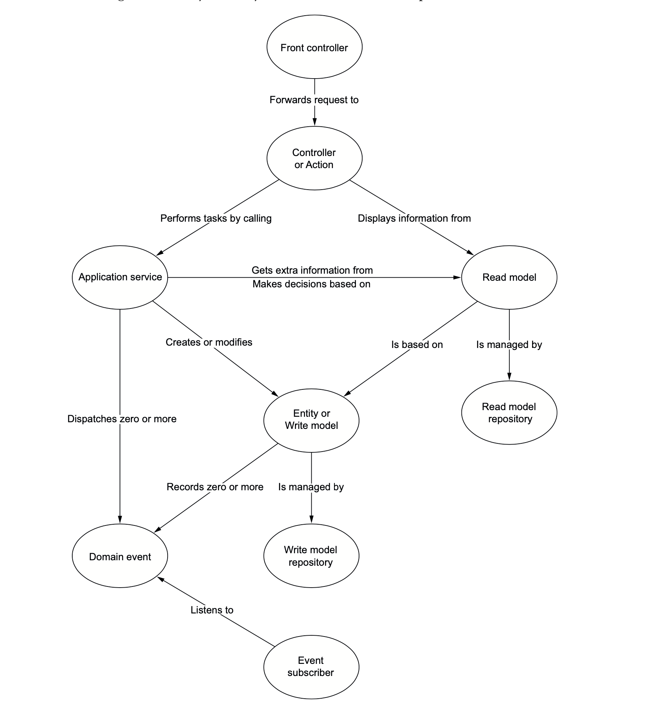

# Type of objects

There are various type of object

## Command
- Controller (service) create DTO (command)
  - to call command handler (application service)
    - that will build value object and entities
      - and will pass them to Repository (service) to persists them.
      - and may emit Domain event

## Query
- Controller create DTO or Domain object
    - To call a Query (Read model)
      - That will build value object
      - And will fetch data from a repository (read model) (the query implementation)

## In image

